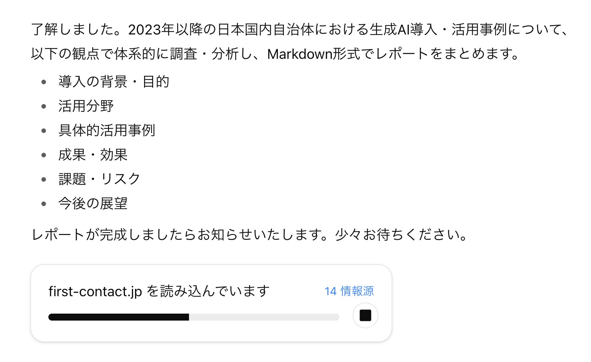

# 自治体職員向け生成AIワークショップ デモンストレーション要件

## 概要
自治体職員向けに生成AIの実践的な活用方法を紹介する4つのデモンストレーションを実施

## 対象者
- 自治体職員（業務改善・効率化に関心のある方）
- 生成AI初心者〜中級者

## デモンストレーション内容

### 1. 画像生成を使った商品宣伝デモ
**目的**: ChatGPTを使って化粧水の商品宣伝用画像を作成してみる。

**内容**:
1. 化粧水のキャッチコピー作成
2. 化粧水画像の生成
3. 画像内のテキストをキャッチコピーに変更

**コンテンツ**:

#### 1. 化粧水の特徴を伝えるキャッチコピーをChatGPTで生成


#### 2. 化粧水画像の生成

##### 2.1 プロンプト
```
あなたはプロのイラストレーターです。 
以下の条件に従い、女性用化粧水を宣伝するチラシに掲載する画像を作成してください。 

###条件：
・化粧水の商品の魅力が伝わるような画像 
・明るい色がメイン 
・縦：横＝2：1
```

##### 2.2 出力例


#### 3. 画像内のテキストをキャッチコピーに変更

##### 3.1 画像を選択する


##### 3.2 プロンプト
```
キャッチコピーを以下にしてください。 

肌に、水のごちそうを。
```

##### 3.3 出力例


**所要時間**: 15分

---

### 2. DeepResearchを使った情報検索デモ
**目的**: 他の自治体の生成AI活用事例を調査してレポートにまとめる

**内容**:
- 複数の自治体の生成AI導入事例を自動収集
- 活用分野別の整理（窓口業務、文書作成、情報発信等）
- 成功事例と課題の分析
- 調査結果を構造化されたレポートとして出力

**既存の調査方法（DeepResearchを使わない場合）**:
1. Google検索で「自治体 生成AI 活用事例」を検索（30分）
2. 各自治体のプレスリリースを個別に確認（1時間）
3. 総務省・デジタル庁の報告書を探して読む（1時間）
4. 情報をExcelに手動で転記・整理（2時間）
5. Word等でレポート作成（1時間）
→ **合計：約5時間30分**

**DeepResearchを使った場合**:
1. プロンプトで調査内容を指示（1分）
2. 自動で情報収集・分析・レポート生成（10分）
3. 生成されたレポートの確認・微調整（30分）
→ **合計：約40分**

**コンテンツ**:

#### 1.1 初期プロンプト
```
優秀なリサーチャーとして、Deepresearchを使って以下のレポートをまとめたいです。

他の自治体の生成AI導入・活用事例

このプロンプトをもっとよくしてください。
```

#### 1.2 改善プロンプト
```
あなたは優秀なリサーチャーです。  
以下のテーマについて、Deepresearchを用いて体系的に調査・分析を行い、レポートをまとめてください。

---

### テーマ
他の自治体における生成AI導入・活用事例

---

### 調査・分析観点
- 導入の背景・目的（課題認識、政策文脈）  
- 活用分野（例：文書作成、窓口対応、議事録要約、教育、観光PRなど）  
- 活用事例の具体例（どのような業務・サービスでAIが使われているか）  
- 成果や効果（定量的指標・定性的効果の両方）  
- 課題・リスク（予算、職員スキル、住民への影響、セキュリティ、ガイドラインなど）  
- 今後の展望や発展可能性  

---

### 出力フォーマット（Markdown形式）

# 他自治体の生成AI導入・活用事例レポート

## 1. 概要
（調査全体のまとめ）

## 2. 事例一覧
### 自治体名: ○○市
- **背景・目的**: …  
- **活用分野**: …  
- **具体的事例**: …  
- **成果・効果**: …  
- **課題・リスク**: …  
- **今後の展望**: …  

（複数自治体分を同様に記載）

## 3. 比較分析
- **共通点**  
- **相違点**  
- **成功要因**  
- **失敗/課題要因**

## 4. 提言
（本調査から得られる示唆や応用可能性）
```

#### 1.3 出力例


#### 1.4 実行中画面


#### 1.5 実行時間等
- 8分
- 15件の情報源
- 33件の検索

#### 1.6 出力結果


#### 1.7 共有リンク
https://chatgpt.com/s/dr_68b69c6be5ec8191a9712e747e9f63b9

**所要時間**: 15分

---

### 3. 生成AIをフル活用した資料作成デモ
**目的**: 生成AIを使った効率的な資料作成の実演

**内容**:
- デジタル庁の行政の進化と革新のための生成AIの調達・利活用に係るガイドラインを参考に、都留市におけるガイドラインの骨子を作成する。

**想定シナリオ**:
- 市民アンケート結果の報告書作成
- 議会提出資料の下書き作成
- 広報資料の文案作成

**コンテンツ**:

#### 1. 参考ガイドライン
https://www.digital.go.jp/assets/contents/node/basic_page/field_ref_resources/e2a06143-ed29-4f1d-9c31-0f06fca67afc/80419aea/20250527_resources_standard_guidelines_guideline_01.pdf

#### 2. 初期プロンプト
```
あなたは山梨県都留市の地方自治体職員です。
添付したガイドラインの内容を理解し、都留市におけるガイドラインの骨子を作成する役割があります。

このプロンプトをもっとよくして
```

#### 3. 改善プロンプト
```
## 改善版プロンプト

あなたは**山梨県都留市の地方自治体職員**です。  
役割は、添付されたガイドラインを正確に理解し、都留市の実情に即した「生成AI活用ガイドラインの骨子」を作成することです。  

### 指示内容
1. 添付されたガイドラインの要点を抽出し、都留市に適用可能な部分と修正が必要な部分を整理してください。  
2. 都留市の課題や政策文脈（人口減少、少子高齢化、行政効率化、観光振興など）を踏まえ、骨子案を再構築してください。  
3. 骨子は以下の要素を含めてください：  
   - **基本理念・目的**  
   - **適用範囲（対象となる業務分野や職員）**  
   - **活用分野（例：文書作成、窓口対応、議事録要約、教育、観光PRなど）**  
   - **利用ルール・留意事項（個人情報保護、セキュリティ、誤用リスク）**  
   - **導入体制・運用プロセス（承認フロー、試行導入、評価方法）**  
   - **職員研修・市民への説明責任**  
   - **今後の発展可能性（市の特色を活かした利活用の方向性）**  

### 出力形式
Markdown形式で作成し、見出しをつけて整理してください。  
最終成果物は、市長や部長に提示できるレベルの「骨子案」としてください。  
```

#### 4. 出力例


#### 5. Canvasの使い方の例デモ
```
男女の恋愛小説を100文字程度で書いてください。
```
- 修正提案
- 文章の長さ調節
- 読解レベル調整

**所要時間**: 15分

---

### 4. RAGを利用したチャットボットのデモ
**目的**: 自治体専用知識ベースを活用したAIチャットボットの紹介

**内容**:
- RAG（Retrieval-Augmented Generation）の仕組み説明
- 条例・規則データベースを活用した問い合わせ対応
- 市民向けFAQボットの実演
- 職員向け業務マニュアル検索システム

**想定シナリオ**:
- 市民からの問い合わせ自動応答
- 職員の業務マニュアル検索
- 条例・規則の即座確認

**コンテンツ**:

#### 1. RAGの基本概念説明

↓


##### 1.1 従来のAIチャットボットの課題
- 学習データの時点で知識が固定
- 最新情報や組織固有の情報に対応できない
- 誤った情報を生成する可能性（ハルシネーション）

##### 1.2 RAGによる解決
```
【RAGの仕組み】
1. 質問を受ける
2. 関連文書を検索（ベクトル検索）
3. 検索結果を参照しながら回答生成
→ 最新かつ正確な情報に基づく回答が可能
```

#### 2. デモンストレーション：都留市の情報を回答するチャットボット

https://lately-large-garfish.ngrok-free.app/chat/94OethPUJ5Pgu1rO

##### 2.1 準備したナレッジベース
- 都留市公式ウェブサイトのデータ

##### 2.2 質問例と回答デモ

**質問1：基本的な市政情報**
```
Q: 都留市の図書館の開館時間を教えてください

A: 都留市立図書館の開館時間は、火曜〜金曜が10:00〜19:00、土曜日祝が10:00〜17:00です。
   休館日は月曜日と年末年始となります。お出かけ前に最新の情報を公式サイト等でご確認されると安心です。
```

**質問2：手当に関する問い合わせ**
```
Q: 子供手当について教えてください

A: 児童手当について知りたいのですね。2024年10月改正後の主な内容は次のとおりです。

- 支給額
  - 0歳〜3歳未満: 月額 15,000円
  - 3歳〜小学校修了前: 月額 10,000円
    - 第3子以降は月額 30,000円
  - 中学生: 月額 10,000円
  - 高校生年代（15歳年度末〜18歳年度末）: 月額 10,000円
    - 第3子以降は月額 30,000円

- 支給時期
  - 偶数月に支給（2月・4月・6月・8月・10月・12月）

- 申請期限
  - 令和7年3月31日まで（高校生年代の新規申請を含む）

もし該当するお子さんの年齢やFamily構成によって支給額が変わるので、具体的なケースを教えていただければ、
該当する区分での金額を一緒に確認します。最新の情報や申請手続きの詳細は、市役所の児童手当窓口や
公式サイトでご確認ください。
```

**質問3：防災に関する問い合わせ**
```
Q: 川棚の避難場所は？

A: 川棚地区の避難場所は、川棚農業指導センターが指定されています。住所は都留市川棚地区です。
   なお、土砂災害時は避難先を谷村第一小学校へ移動しますので、緊急時には現場の指示に従ってください。
   普段から自治会の避難計画を確認しておくと安心です。
```

---
